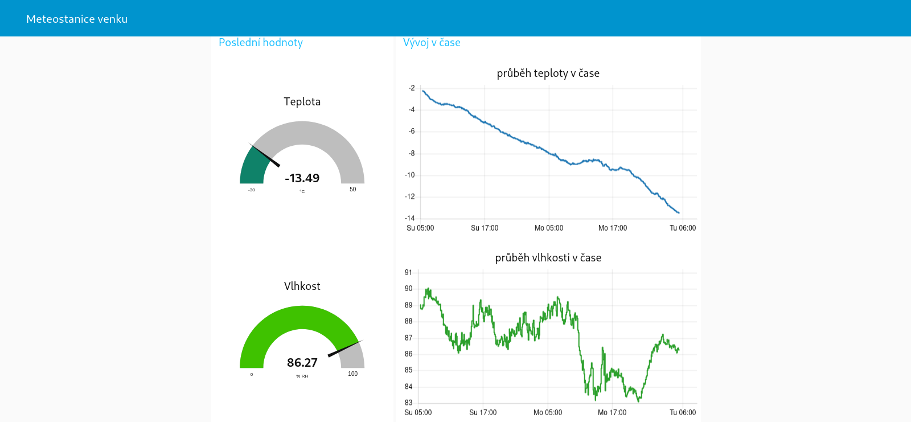
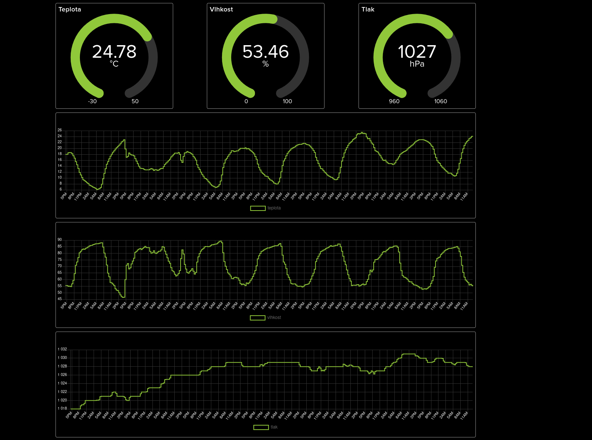

# iot-weather-station

IoT weather station is an Arduino Nano 33 IoT based weather station that reads data about temperature, humidity and air pressure using sensors SHT30 and BMP180. It then sends them via MQTT periodically to a device running a Node-RED instance taht displays the info on a web dashboard. Node-RED flow is also configured to send the data to Adafruit IO cloud (using MQTT).

## Ignored file should look like this:

### src/arduino_code/arduino_secrets.h
```
#pragma once
#define SECRET_SSID "your ssid"
#define SECRET_PASS "your password"
```
## Photos of the weather station


## Screenshots of dashboards
### In Node-RED:

### Adafruit IO:

